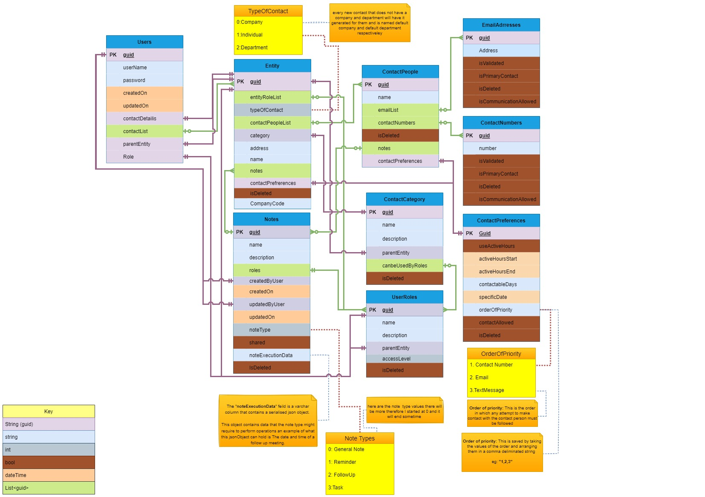
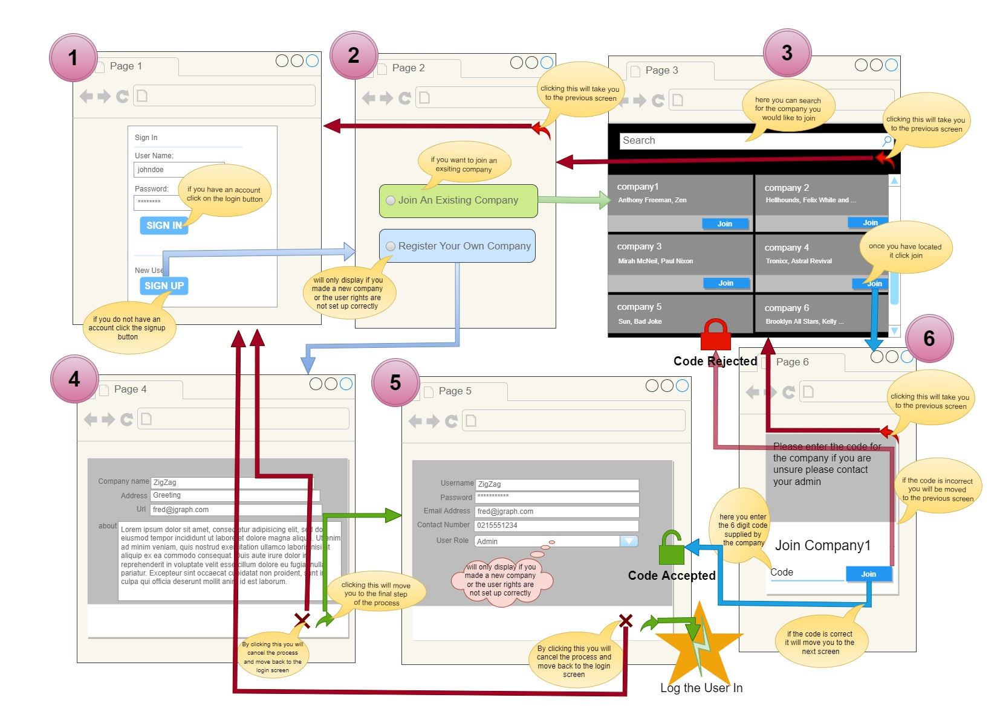

# Contact-Keeper

## Introduction

The simplest tasks often are the most difficult. this development test while easy to just complete I find it more fun
and rewarding to over engineer a bit and this is 100% what I have done here.

instead of just a contact keeper I am designing a business suite contact manager the idea is that you can set your
companies roles and permissions and filter your contacts by

category, name, contact numbers etc. I have also made a table dedicated to just the emails and just the contact numbers
this is so that every contact can have multiple email addresses and contact numbers that are unique.

one issue I hope to get the time to address is adding a contact that already exists on the platform just on another
account. I plan on having that contact recieve an email to connect after which the system will populate all thier
details to the adding system

## Database

the key concept to understand is that while this is a contact manager I have seperated the contact from the person
and made a database design that i believe will allow for easy additions later



## Wireframes and Api

### Registration

#### Wireframe

this is the register wireframes while they are not artistically sound they more are there to serve as a guide
the numbers above the frames ***DO NOT INDICATE ORDER*** they are merely there to as a reference



#### Api

This is how you interact with the api via rest

<table>
<thead>
<tr>
<th>Name</th>
<th>Method</th>
<th>Request Body</th>
<th>Successful Response</th>
<th>Failure Response</th>
<th>EndPopint</th>
</tr>
</thead>

<tbody>
<tr>
<td>ValidateCompanyCode</td>
<td>Post</td>
<td>

```json
{
  "companyName": "zippy",
  "companyCode": "abc945"
}
```

</td>
<td>

```json
{ 
    "result": 200,
    "Token":"hfjgfhjgfhgfghffg5757hgvhgf"
}
```

</td>
<td>


```json
{ 
    "result": 500,
    "reason": "the code was invalid"
}
```

</td>
<td> 

```text
/api/User/Register?Join=true
```

</td>
</tr>
<tr>
<td>RegisterNewCompany</td>
<td>Post</td>
<td>

```json 
{
    "companyName":"fizzbuzz",
    "companyAddress":"13 fizbuz avenue"
}
```

</td>

<td>

```json
{ 
    "result": 200,
    "Token":"hfjgfhjgfhgfghffg5757hgvhgf"
}
```

</td>
<td>


```json
{ 
    "result": 500,
    "reason": "there is already a company with that name"
}
```

</td>
<td> 

```text
/api/User/Register?Join=false 
```

</td>
</tr>
<tr>
<td>RegisterUserWithCompany</td>
<td>Post</td>
<td>

```json
{ 
    "Token":"hfjgfhjgfhgfghffg5757hgvhgf",
    "name":"DemoName",
    "EmailAddresses":["test@test.com","test@test2.com"],
    "ContactNumbers":["1234567","23451678"],
    "ContactPreferences":
    {
        "UseAciveHours":true,
        "activeHoursStart":"12:10am"
        "activeHoursEnd":"3:00am"
        "contactableDays":"M,T,W,TH,F,S,SN",
        "ContactOrderOfPriority":"1,2,3",
        "ContactAllowed":true
   }
}
```

</td>
<td>

```json
{ 
    "Jwt":"hfjgfhjgfhgfghffg5757hgvhgf",
    "expiresAt":"17:59"
}
```

</td>
<td>

```json
{
  "result": 500,
  "reason": "you are already registered to this entity"
}
```

</td>
<td>

```
/api/User/Register?validate=true
```

</td>
</tr>
</tbody>
</table>

